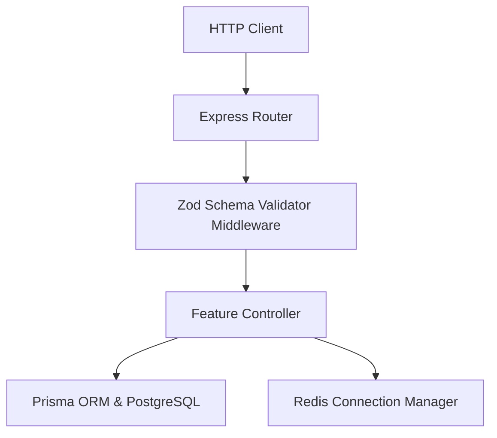

# Backend Architecture Documentation

This document describes the architectural design, folder structure, validation flows, and patterns implemented in the Trip Wala backend API service.

---

## 🏛️ Clean Architecture Principles

The backend is built around modular, decoupled layers to maintain a strict separation of concerns:

*   **Express Routing Layer**: Receives HTTP requests, validates input schemas, and forwards traffic.
*   **Controller Layer**: Coordinates features, interacts with Prisma repositories, builds standard JSON envelopes, and returns HTTP statuses.
*   **Database (Prisma Client)**: Manages query compositions, entity relationships, and connection pools.
*   **Cache (Redis Client)**: Manages rate-limiting counters, active socket presence registries, and fast revocations.

---

## 📂 Folder Structure

```text
src/
├── core/                  # Core modules shared across features
│   ├── config.ts          # Zod validation schema for environment variables
│   ├── db.ts              # Global PrismaClient instantiator
│   ├── redis.ts           # Redis client connector class
│   ├── logger.ts          # Pino logging config
│   ├── errors.ts          # Standard ApiError subclasses & global handler
│   ├── health.ts          # Live, ready, and process health routes
│   ├── middlewares.ts     # Request ID, Logging, Zod, and JWT filters
│   ├── jobs/              # BullMQ background queues, worker threads, and task types
│   └── swagger.ts         # OpenAPI / Swagger JSON contract definitions
├── features/              # Feature modules (vertical slice modules)
│   ├── auth/              # Registration, logins, and refresh tokens
│   │   ├── auth.controller.ts
│   │   ├── auth.routes.ts
│   │   ├── auth.schemas.ts
│   │   └── __tests__/
│   │       └── auth.test.ts
│   ├── users/             # User accounts fetcher and soft-delete controls
│   │   ├── users.controller.ts
│   │   ├── users.routes.ts
│   │   └── __tests__/
│   │       └── users.test.ts
│   ├── profiles/          # Public flat profiles, search, filters & statistics
│   │   ├── profiles.controller.ts
│   │   ├── profiles.routes.ts
│   │   └── profiles.schemas.ts
│   ├── trips/             # Travel group trips, itineraries, permissions & search
│   │   ├── trips.controller.ts
│   │   ├── trips.routes.ts
│   │   ├── trips.schemas.ts
│   │   └── __tests__/
│   │       └── trips.test.ts
│   └── memberships/       # Applications, invitations, permissions & capacity management
│       ├── memberships.repository.ts
│       ├── memberships.service.ts
│       ├── memberships.controller.ts
│       ├── memberships.routes.ts
│       ├── memberships.schemas.ts
│       └── __tests__/
│           └── memberships.test.ts
├── types/                 # Custom type augmentation definitions
│   └── express.d.ts
├── app.ts                 # Express application orchestrator
└── server.ts              # Server bootstrapper & DB connector
```

---

## ⚙️ Background Job Processing

To ensure high performance and low response times, long-running and resource-intensive tasks are run asynchronously:

* **Technology**: Built on top of **BullMQ** and backed by a dedicated **Redis** connection.
* **Queues**: Unified queue named `trip-wala-jobs` managed by `enqueueJob` utility.
* **Worker Thread**: Concurrently processes jobs with automated exponential retries and failure retention.
* **Supported Tasks**:
  1. `notification-fanout`: Handles delivery of notifications to group members asynchronously.
  2. `email-delivery`: Handshakes with external SMTP providers.
  3. `cleanup`: Periodically purges stale sessions and expired records.
  4. `trust-score-recalculate`: Recomputes traveler trust scores on review submit.
  5. `maintenance`: System tasks and diagnostics.

---

## 🔄 Dependency Flow & Modularity

Modules are organized as **vertical slices** under `src/features/`. Each slice manages its own schemas, routes, controllers, and tests.



### Flow Responsibilities:
1.  **Validation**: All request parameters, query variables, and request body payloads are validated immediately at the entry point of the route using `validateBody`, `validateQuery`, or `validateParams` middlewares.
2.  **Controllers**: Keep controllers slim. They are responsible for processing inputs, querying databases, and sending the standard API response format.
3.  **Database & Cache**: Execute SQL transactions via Prisma or save ephemeral state to Redis.

---

## 🔌 Standard API Response Formats

To ensure consistent responses for the client:

### Successful Responses (2xx):
```json
{
  "success": true,
  "message": "Operation description",
  "data": { ... }
}
```

### Failed Responses (4xx/5xx):
```json
{
  "success": false,
  "error": {
    "code": "ERROR_CODE_NAME",
    "message": "Human readable reason"
  },
  "requestId": "uuid-request-id-123"
}
```

---

## 🚦 Request ID Tracking & Logging

*   Every inbound request is assigned a unique UUID `requestId`.
*   Logs written using **Pino** output structured logs with the associated `requestId`, `userId`, `sessionId`, endpoint path, latency, and status code.

---

## 🔐 Authentication Lifecycle

1.  **Login/Register**: Upon verification, the backend starts a new `Session` record in PostgreSQL.
2.  **Token Issuance**: The client receives a JWT Access Token (expires in 15 minutes) and a JWT Refresh Token (expires in 7 days).
3.  **Rotation (Strict FIFO)**: When `/api/v1/auth/refresh` is requested, the previous `RefreshToken` is deleted from the database, the `Session` last active timestamp is updated, and a brand new refresh/access token pair is returned to the client.
4.  **Logout/Revocation**: Deleting a session via `/api/v1/auth/logout` deletes the session from the PostgreSQL database, automatically invalidating all associated refresh tokens.

---

## ➕ Guidelines: How to Add New Modules

When implementing a new feature module (e.g. `trips`):
1.  Create a folder `src/features/trips/`.
2.  Define models in `prisma/schema.prisma` and run `npx prisma migrate dev` to update Prisma client bindings.
3.  Create `trips.schemas.ts` defining Zod validation objects.
4.  Create `trips.controller.ts` containing the request/response handling logic.
5.  Create `trips.routes.ts` linking controller endpoints to paths, applying `authMiddleware` and Zod validators.
6.  Mount the router inside `src/app.ts` under `/api/v1/trips`.
7.  Write integration tests inside `src/features/trips/__tests__/trips.test.ts`.

---

## 🤝 Applications & Invitations State Machine

We enforce strict validation rules for transitions and capacity calculations:

### Application Lifecycle States:
*   `pending` -> Can be transitioned to `accepted`, `rejected`, or `cancelled`.
*   `accepted` -> Terminal state for the application (adds user to `TripMember`).
*   `rejected` -> Terminal state for the application.
*   `cancelled` -> Terminal state (cancelled by applicant).

### Invitation Lifecycle States:
*   `pending` -> Can be transitioned to `accepted`, `declined`, or `cancelled`.
*   `accepted` -> Terminal state (adds user to `TripMember`).
*   `declined` -> Terminal state (declined by invitee, mapped as `'rejected'` for Flutter compatibility).
*   `cancelled` -> Terminal state (cancelled by trip organizer).

### ⚡ Capacity Management & Auto-State Transitions:
1.  **Open to Full**: When accepting applications or invitations, the total number of members is validated against `maxMembers`. If adding the member reaches the limit, the trip status is automatically transitioned from `open` to `full` inside a Prisma Transaction.
2.  **Full to Open**: When a member leaves the trip or is removed, if the trip status was previously `full`, it is automatically transitioned back to `open` inside a transaction.
3.  **Preventive Checks**: Both application submissions and invitation dispatches assert that current member counts do not exceed `maxMembers`.

